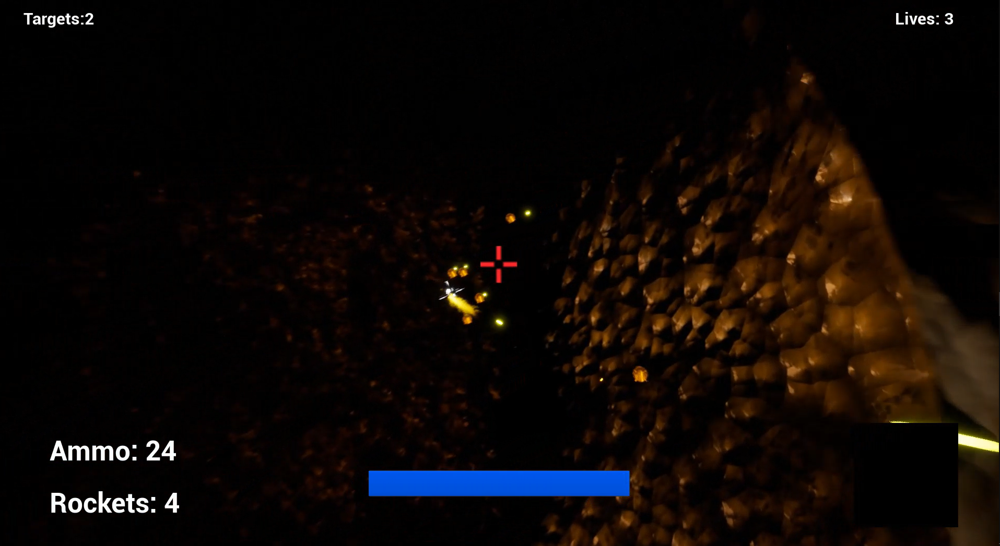
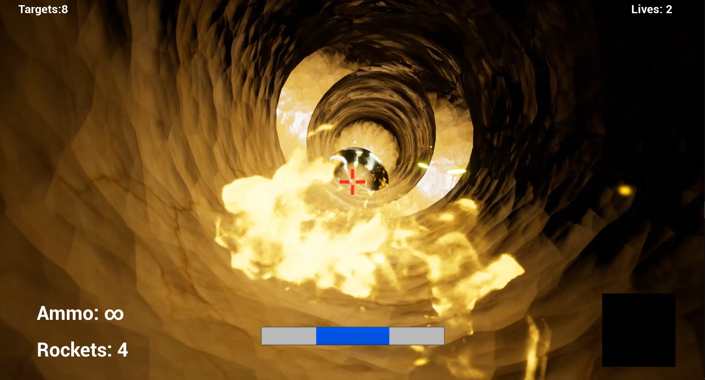
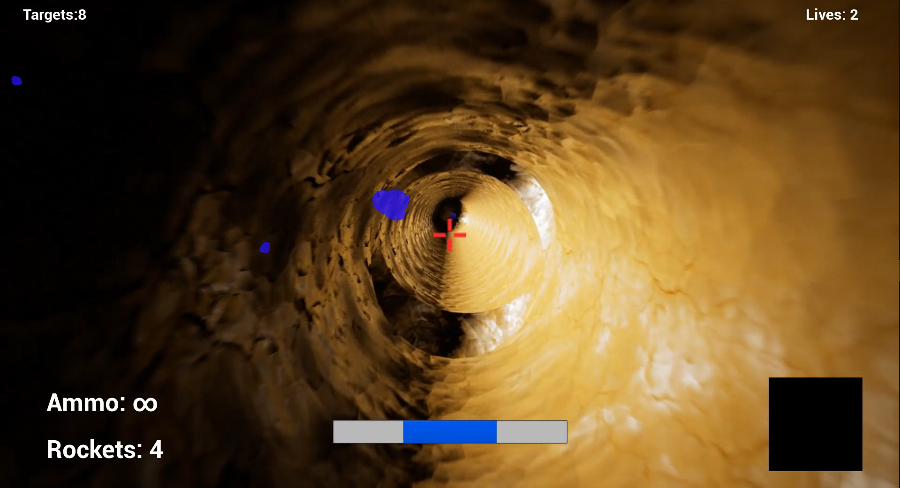

# 50' Inside

## Overview

Remake of the famous FPS game Descent, made in 1995, made under UE.

Demo: https://youtu.be/UK5_WKM__D4

The uploaded version on YouTube is quite slow, so here is a better version of the video, with the real framerate: https://mega.nz/#!b913ESQB!mpz_QUg4lwIgOaI44ZZ5ZQnnL30DMpXu1t3EVbl0WLk

## Run the game

To run the game, extract the four _FinalBuild.partXX.rar_ files, then double click on the _FinalBuild/FiftyMinInside.exe_ file.

## Controls
Fire: Left Mouse Button/Left Ctrl/Right Ctrl

Fire Special: Right Mouse Button/Space Bar

Fire Flare: F

Next Weapon: N

Previous Weapon: B

Pause: P/Escape

Move Forward/Backward: Z/S

Move Left/Right: D/Q

Turn horizontally: Mouse X/Left arrow and right arrow

Turn vertically: Mouse Y/Up arrow down arrow

Roll: A/E

Move Up/Down: C/X

Move Guided Rocket Up: G/J

Move Guided Rocket Up/Down: Y/H
